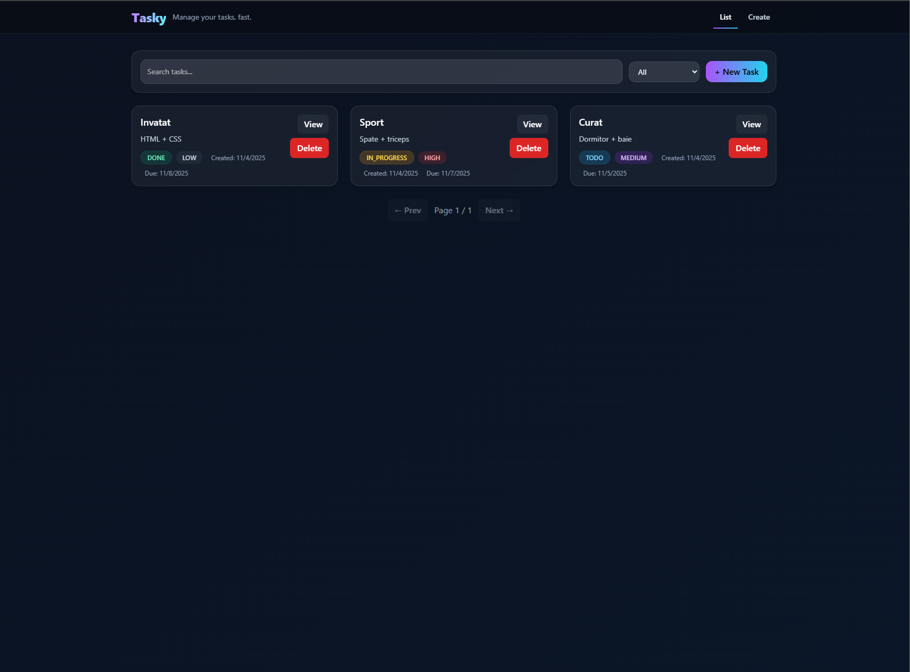
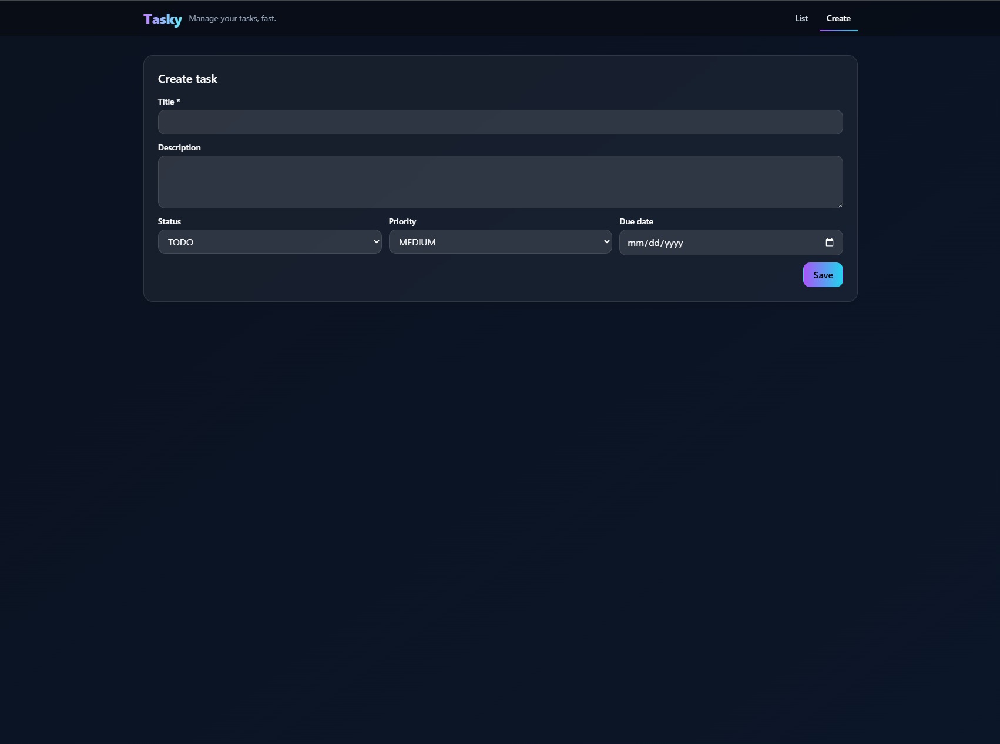

# Tasky


A minimal Task Manager application (Tasky) built with a Spring Boot backend, React + Vite frontend (served by Nginx), and MySQL 8 with Flyway migrations. The UI proxies `/api/*` to the backend when deployed with Docker Compose.

Key features
- CRUD tasks (create, read, update, delete)
- Validation and server-side errors handled by the API
- Pagination, filtering and full-text-ish search (`q` query param)
- Task statuses: `TODO`, `IN_PROGRESS`, `DONE`
- Task priorities: `LOW`, `MEDIUM`, `HIGH` (mapped to UI chips)
- Due date handling and createdAt timestamps

Screenshots

UI list view (placeholder):

<p align="center">
  
</p>

UI create/edit view (placeholder):

<p align="center">
  
</p>


Architecture (ASCII)

```
+-------------+           +--------+           +-------------+
|   Browser   | <-------> |  Nginx | <-------> |  React UI   |
|  (client)   |    1     |(UI svc)|    2      | (static)    |
+-------------+           +--------+           +-------------+
                              |
                              | proxy /api/* -> http://api:8080
                              v
                        +---------------+
                        |   Spring API  |
                        |  (api:8080)   |
                        +---------------+
                              |
                              v
                        +---------------+
                        |   MySQL 8     |
                        |  (db:3306)    |
                        +---------------+
```

Folder structure (top-level)

```
.
├── Dockerfile                 # backend multi-stage Dockerfile (build + nginx)
├── docker-compose.yml         # docker compose for api, ui, db
├── pom.xml                    # Spring Boot Maven project
├── src/                       # Spring Boot backend
│   └── main/java/.../controller/TaskController.java  # /api/v1/tasks
│   └── main/resources/db/migration/ V1__, V2__       # Flyway migrations
├── tasky-ui/                  # React + Vite frontend
│   ├── Dockerfile             # frontend Dockerfile (build + nginx)
│   ├── nginx.conf             # nginx config used by the UI image (proxies /api)
│   ├── vite.config.js         # vite dev proxy for local dev
│   ├── screenshots/           # placeholder screenshots (list.svg, create.svg)
│   └── src/                   # React source (components, pages, api)
│       └── api/http.js        # axios instance (baseURL uses VITE_API_URL or '/api/v1')
│       └── api/tasks.js       # client calls (getAll, create, update, delete)
└── README.md
```

Quick start — Docker (recommended)

This repository includes a `docker-compose.yml` which starts three services:
- `api` — Spring Boot backend (8080)
- `ui` — React static UI served by Nginx (80 inside container -> mapped to host 5173)
- `db` — MySQL 8 (3306)

Unix / macOS

```bash
# Build images (rebuild UI so nginx.conf is included)
docker compose build --no-cache
# Start services in background
docker compose up -d
# Stop
docker compose down
# Rebuild only UI after changing nginx.conf or VITE_API_URL
docker compose build --no-cache ui
docker compose up -d ui
```

Windows (cmd.exe / PowerShell)

```powershell
# Build images (PowerShell)
docker compose build --no-cache
# Start services
docker compose up -d
# Stop
docker compose down
# Rebuild only UI
docker compose build --no-cache ui
docker compose up -d ui
```

Notes about `VITE_API_URL` and deployment
- The UI uses `import.meta.env.VITE_API_URL` at build time if provided, otherwise it defaults to the relative path `/api/v1`.  See `tasky-ui/src/api/http.js`.
- When deploying with Docker Compose using the provided `tasky-ui/nginx.conf`, the UI's Nginx will proxy `/api/*` to the backend service `api:8080`, so the relative path works without additional configuration.
- If you want the frontend bundle to call an absolute backend address, set `VITE_API_URL` at build time (not runtime). Example in a Dockerfile build stage:

```dockerfile
# pass build arg
ARG VITE_API_URL
ENV VITE_API_URL=${VITE_API_URL:-http://api:8080}
RUN npm run build
```

Local development (recommended for faster iteration)

Backend (Spring Boot)

Unix / macOS

```bash
# from project root
./mvnw spring-boot:run
# or build and run
./mvnw clean package
target/tasky-*.jar
```

Windows (cmd.exe)

```cmd
mvnw.cmd spring-boot:run
```

Frontend (React + Vite)

```bash
cd tasky-ui
npm install
# dev server with local proxy to backend configured in tasky-ui/vite.config.js
npm run dev
# production build
npm run build
```

API / database configuration

- Spring Boot datasource is configured via environment variables in `docker-compose.yml`:
  - `SPRING_DATASOURCE_URL` (example: `jdbc:mysql://db:3306/tasky`)
  - `SPRING_DATASOURCE_USERNAME` / `SPRING_DATASOURCE_PASSWORD`
- Flyway migration scripts live in `src/main/resources/db/migration/` (`V1__create_task.sql`, `V2__seed_tasks.sql`). Flyway runs at application startup to bootstrap schema and seed data.

API documentation (quick reference)

Base path: `/api/v1` (controller `@RequestMapping("/api/v1/tasks")`)

Endpoints

- GET /api/v1/tasks
  - Query params: `page` (0-based), `size` (page size), `q` (search), `status` (TODO/IN_PROGRESS/DONE)
  - Example: `GET /api/v1/tasks?page=0&size=10&q=meeting&status=TODO`
  - Response: paginated JSON page (Spring Data Page)

- GET /api/v1/tasks/{id}
  - Response: single task JSON

- POST /api/v1/tasks
  - Body (JSON):

```json
{
  "title": "My task",
  "description": "Details...",
  "priority": "HIGH",
  "status": "TODO",
  "dueDate": "2025-12-31"
}
```

- PUT /api/v1/tasks/{id}
  - Body: similar to POST; updates task

- DELETE /api/v1/tasks/{id}
  - Response: 204 No Content on success

Example curl (host machine)

```bash
# List tasks
curl -i http://localhost:8080/api/v1/tasks
# Create task
curl -i -X POST http://localhost:8080/api/v1/tasks \
  -H "Content-Type: application/json" \
  -d '{"title":"New","description":"desc","priority":"MEDIUM","status":"TODO"}'
```

Pagination note
- The API uses Spring Data `Pageable` (0-indexed page). Provide `page` and `size` query parameters; default `size` is 10 (see controller defaults).

Testing
- Backend unit & integration tests (if present):

```bash
# Run backend tests
./mvnw test
# or on Windows
mvnw.cmd test
```

- Frontend tests (if present):

```bash
cd tasky-ui
npm test
```

Troubleshooting

502 Bad Gateway from Nginx proxy
- Symptom: Browser shows `502` when requesting `/api/v1/...` while the backend logs show it's running.
- Causes & fixes:
  1. Nginx cannot resolve or reach the `api` service inside the Docker network.
     - Exec into the UI container and test:

```bash
# from host
# 1) list containers
docker compose ps
# 2) open a shell in the UI container
docker compose exec ui sh
# inside the container:
getent hosts api
curl -i http://api:8080/actuator/health
curl -i http://api:8080/api/v1/tasks
```

If `getent` shows no entry or curl fails, ensure the `api` service is up (`docker compose up -d api`) and both services run in the same Compose project/network.

  2. Nginx config path or proxy settings are incorrect.
     - Confirm the UI image contains `tasky-ui/nginx.conf` (it should be copied to `/etc/nginx/conf.d/default.conf` in the frontend Dockerfile). The config used by this repo proxies `/api/` to `http://api:8080`.

  3. Backend not listening on 0.0.0.0 or binding to localhost only.
     - Spring Boot typically listens on 0.0.0.0 in Docker. Confirm with `docker compose logs api`.

CORS issues
- For local dev (Vite dev server proxies to `http://localhost:8080`), CORS is usually not a problem because the dev proxy handles requests. If using absolute URL (frontend calling `http://localhost:8080` directly), ensure the API allows cross-origin requests or set `@CrossOrigin` appropriately. The controller currently has `@CrossOrigin(origins = "*")` for development permissiveness.

DB not ready / Flyway errors
- If the API fails to connect to MySQL at startup, ensure the `db` service is healthy and the `SPRING_DATASOURCE_URL` matches `jdbc:mysql://db:3306/tasky`.
- Check `docker compose logs db` for MySQL startup errors and `docker compose logs api` for Flyway error traces.

Continuous Integration (CI)

This project includes a recommended GitHub Actions workflow you can add to `.github/workflows/ci.yml` to run backend tests, lint or build the frontend, and optionally build the Docker images.

Example `.github/workflows/ci.yml` (minimal):

```yaml
name: CI

on:
  push:
    branches: [ main, master ]
  pull_request:
    branches: [ main, master ]

jobs:
  backend:
    runs-on: ubuntu-latest
    steps:
      - uses: actions/checkout@v4
      - name: Set up JDK 21
        uses: actions/setup-java@v4
        with:
          java-version: '21'
          distribution: 'temurin'
      - name: Build & test backend
        run: ./mvnw -B clean verify

  frontend:
    runs-on: ubuntu-latest
    needs: backend
    steps:
      - uses: actions/checkout@v4
      - name: Use Node.js 20
        uses: actions/setup-node@v4
        with:
          node-version: '20'
      - name: Install and test frontend
        working-directory: tasky-ui
        run: |
          npm ci
          npm run build
```


License

This project is licensed under the MIT License — see the `LICENSE` file for details.

Credits
- Built with Spring Boot (Java 21), React + Vite, Nginx, MySQL, Flyway, and Docker Compose.
